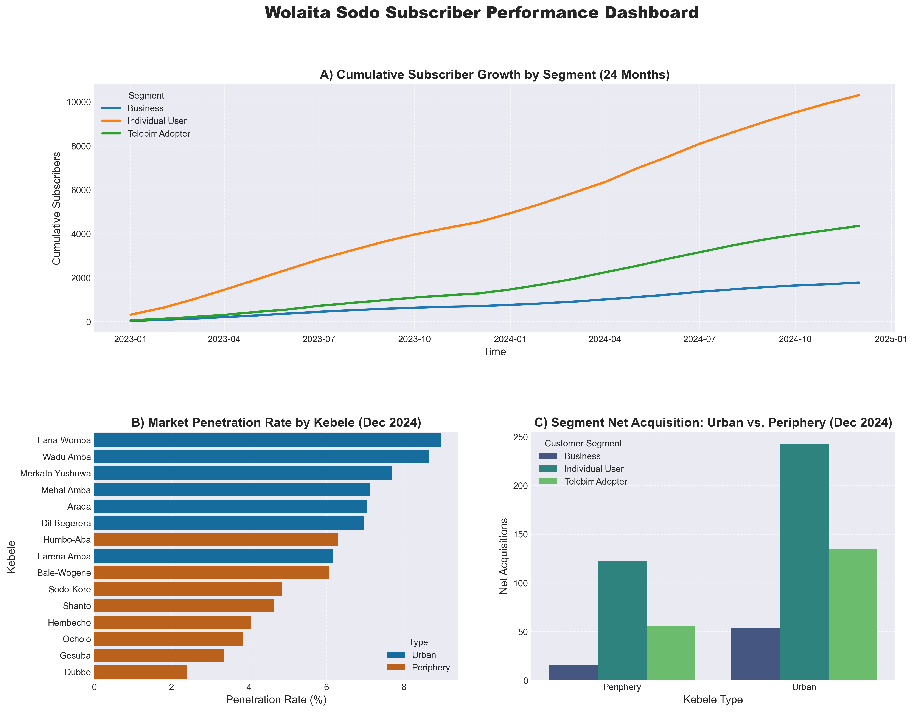

# Wolaita Sodo Telecom Subscriber Growth & Penetration Analysis

## Project Overview
This project simulates a comprehensive data analytics pipeline for a telecom provider operating in the **Wolaita Sodo district, Ethiopia**. The goal is to track, analyze, and forecast subscriber growth across different **kebeles** (localities) and key **customer segments** (Individual Users, Businesses, Telebirr Adopters).

The analysis transforms raw acquisition and churn data into actionable business intelligence to guide strategic investment and marketing focus.

## Business Problem
The company needs a data-driven solution to understand the spatial and behavioral dynamics of its subscriber base. The analysis aims to answer critical questions:
1.  **Market Saturation:** Which kebeles are nearing saturation, and where is the greatest opportunity for new subscriber acquisition?
2.  **Growth Drivers:** Which customer segments and geographic areas are driving the highest **Net Growth** and **MoM/YoY** rates?
3.  **Forward Planning:** What is the reliable **12-month forecast** for total subscriber growth to inform budget and infrastructure decisions?

---

## Technical Stack & Methodology

This project demonstrates expertise across the entire data science lifecycle, from simulation to visualization.

| Category | Tools & Libraries | Skills Demonstrated |
| :--- | :--- | :--- |
| **Data Simulation** | Python, `pandas`, `numpy`, `random` | Generating realistic time-series data with trend, seasonality, and geographic bias. |
| **Data Wrangling** | Python, `pandas` | Feature Engineering: Calculating **Cumulative Subscribers**, **Market Penetration Rate**, and **Month-over-Month (MoM) Growth**. |
| **Time Series & Forecast** | Python, `Prophet (Meta)` | Applying a robust model to decompose trends and forecast the next 12 months of cumulative subscribers. |
| **Visualization** | Python, `matplotlib`, `seaborn` | Creating a multi-panel, high-fidelity **Dashboard** for executive reporting and geographic comparison. |

---

## Key Findings & Deliverables

### 1. Geographic Penetration Map
**Deliverable:** A comparison of Market Penetration Rate across 15 kebeles.
* **Insight:** **Urban areas like Fana Womba show > 80% penetration, indicating saturation, while Periphery kebeles like Humbo-Aba offer high untapped potential.**
* **Action:** Recommend shifting acquisition resources from saturated Urban centers to high-potential Periphery kebeles where the Penetration Rate is lowest.

### 2. Segment Performance & Trend
**Deliverable:** Time series analysis of segment growth.
* **Insight:** **The Telebirr Adopter segment saw an 20% spike in growth in Year 2, confirming the success of the recent digital push."**
* **Action:** Continue investment in digital financial services infrastructure to maintain the momentum of the fastest-growing segment.

### 3. 12-Month Forecast
**Deliverable:** Predicted cumulative subscriber count for the next year.
* **Insight:** The model forecasts a total subscriber count of **3500** by **December 2025**, providing a clear target for capacity planning.
* **Action:** Use the predicted figures and confidence intervals for budgeting and network capacity expansion.

---
*Developed by: **Aklilu Abera***
